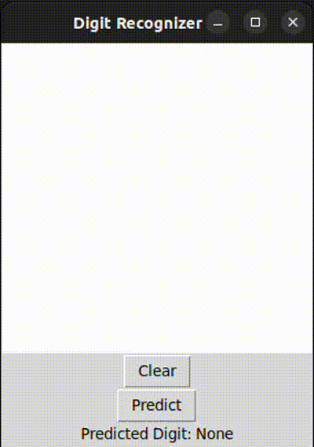

# Digit Recognizer

## Features
In my research, I study the following classification algorithms:
- Logistic Regression
- K Nearest Neighbours (KNN)
- Decision Tree
- Random Forest
- Gradient Boosting
- Convolutional Neural Network (CNN)

See the [research.ipynb](research.ipynb) file for details.

I use CNN in my application for digit recognition:



# Installation
To install the necessary dependencies for this project, follow these steps:

1. Clone the repository:
    ```sh
    git clone https://github.com/Jduun/DigitRecognizer.git
    cd DigitRecognizer
    ```
2. Create a virtual environment:
    ```sh
    python -m venv venv    
    ```
3. Activate a virtual environment:
   ```sh
   source venv/bin/activate
   ```
4. Install the dependencies:
   ```sh
   pip install -r requirements.txt
   ```
5. Run the project:
   ```sh
   python main.py
   ```

## License

This project is licensed under the MIT License - see the [LICENSE](LICENSE) file for details.
